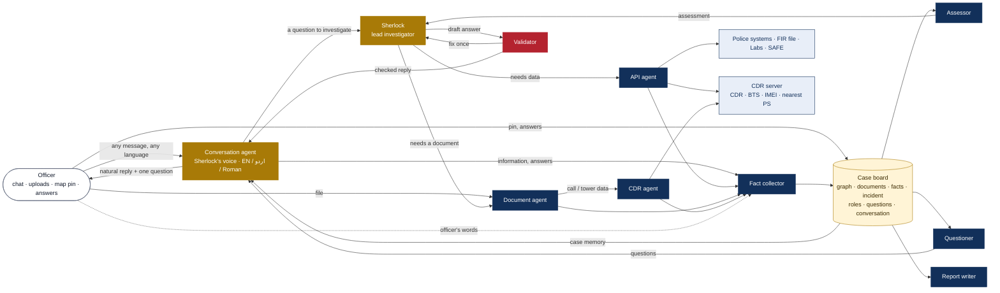
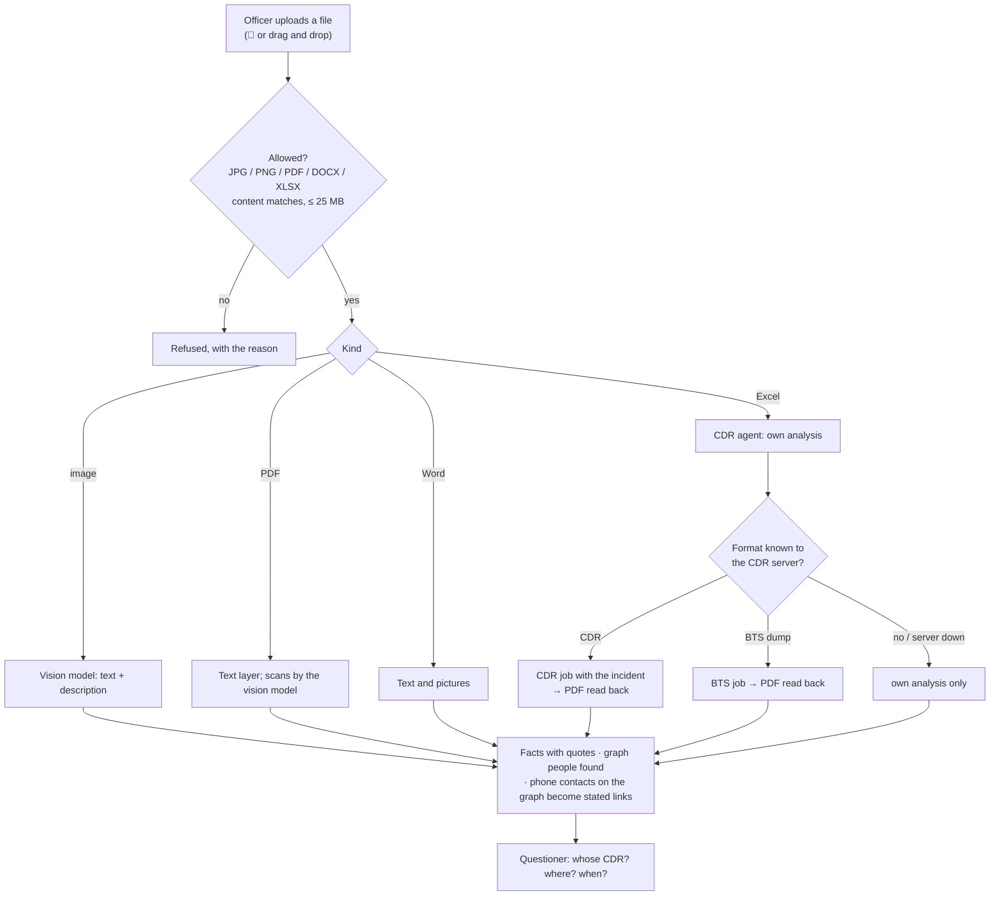

# Sherlock: how the agents work together

Sherlocks is worked by a team of agents. The officer talks to one of them, the
**Conversation agent** (Sherlock's voice), in English, Urdu or Roman Urdu; the others
investigate, fetch, read, record, assess, question and check behind it. They do not message each
other: they share one **case board**, and each agent reads it, does its job, and writes
its result back **with a source**. Anything new on the board (a file, an answer, a pin on
the map) wakes the agents that need it.



## The case board

| Part | What it holds | Written by |
|---|---|---|
| Link graph | people, records, stated and inferred links | Search agent, Linker, CDR agent |
| Documents `D#` | FIR files, lab reports, CRO dossiers, uploaded files, CDR analyses, the officer's statements | Collector, Document agent, CDR agent, Fact collector |
| Facts `F#` | one sentence + the verbatim quote it rests on + its document | Reader, Fact collector, CDR agent |
| Evidence links `L#` | a graph person found in a document, and the line that shows it | Linker |
| Incident | place (pinned on the map), date, time, FIR, nearest police station | Officer (map), Fact collector, API agent |
| Roles | main suspect, suspect, victim... as stated by the officer | Fact collector, officer's answers |
| Open questions `Q#` | what the team still needs, with an answer button | Questioner |
| Assessment | the latest conclusion and hypotheses | Assessor |
| Conversation | every question and answer, with the Validator's result | Sherlock |

Code: `src/sherlocks/evidence/case_file.py`. The board travels with the graph
(`graph.case`), so a saved graph keeps it.

## The agents

| Agent | Job | Model use | Live calls | Code |
|---|---|---|---|---|
| **Conversation agent** | The one voice the officer talks to. Detects the language (Urdu script, Roman Urdu, English) and replies in it; tells a question from information, an answer or a greeting; speaks from the whole **case memory** (targets, connections, findings, every FIR / medical / CRO / uploaded document's facts, what the officer said); tells what is new since the last message; asks at most one question per message, not the same one twice in a row | yes; templates in the three languages without it | no | `linkgraph/conversation.py` |
| **Sherlock** (lead) | Plans each answer as a sequence of tool calls; hands work to the specialists; never expands the graph itself | planning and wording | only through the API agent | `linkgraph/investigator.py` |
| **API agent** | Calls any connected API: the 22 police systems (`lookup`), FIR file, lab reports, CRO dossier, and the CDR server's `imei` and `nearest_ps` lookups (`cdr_lookup`) | none | yes, max 6 per question, cached and audited | `investigator.py` tools, `evidence/sources.py`, `evidence/cdr.py` |
| **Document agent** | Reads documents and uploads: PDF text, scanned pages and photos by the vision model (Urdu and English), Word text and pictures | vision model | no | `evidence/uploads.py`, `evidence/pdf_reader.py` |
| **CDR agent** | Excel call records and tower dumps. Known formats: the CDR server's CDR / BTS analysis, PDF read back. Always: its own analysis - subscriber, top contacts, contacts on the graph, frequent locations, IMEIs, the incident day, towers near the pin | only to map unfamiliar columns | CDR server | `evidence/cdr.py` |
| **Collector, Reader, Linker** | While the graph builds: fetch FIR files, lab reports, CRO dossiers; quoted facts; graph people found in documents | Reader: yes, quote-checked | yes, max 40 documents per run | `evidence/collector.py`, `evidence/readers.py` |
| **Fact collector** | Records what the officer **states** (not questions) with the exact words: incident date, roles, events | yes, rules without it | no | `linkgraph/sherlock_team.py` (`collect`) |
| **Assessor** | Writes the conclusion from the tool results; keeps the case assessment current | yes, rules without it | no | `investigator.py` (`_llm_final`) |
| **Knowledge base** | Everything known, as searchable entries: each person's identifiers, father, addresses, phones, vehicles, FIRs with role and status, hotel stays, every link on the graph; every field of every record (NADRA, DLS, CRO, PRVS, ARMS...); every quoted fact of every document read; the officer's statements and the incident. Rebuilt whenever the graph or the case board changes, so it is always live. Any question - not only the fixed types - is answered from it | no (search by code) | no | `linkgraph/knowledge.py` |
| **Facts agent** | Exact answers by code: FIR count and list, FIR status, serious FIRs (crimes named from the sections; his role in each), what each FIR alleges and what the IO concluded (challan, A / B / C class, 169 - quoted from the FIR file), criminals near a person or in the graph, connections, hotels, phones, vehicles. Writes the reply's opening sentences in the officer's language when the model is off | no | no | `linkgraph/case_queries.py`, `offences.py`, `narrate.py` |
| **Research agent** | When nothing gathered answers the question (or an FIR asked about has no file read yet), it goes and gets it - by rules, model or not: the FIR file, its lab reports, the CRO dossier, or the police systems that hold what is asked (job: EVS / HOPE / HRMIS / PRVS; vehicles: Excise / AVLC / TRACS; phones: SIMs / subscriber; hotels: Hotel Eye; weapons: Arms; record: PSRMS / CRO / watchlist), skipping systems already searched for that person. The answer is then rebuilt from what came back, and the reply says what was checked live | no (rules) | yes, within the per-question budget (6), audited | `linkgraph/researcher.py` |
| **Validator** | Checks every answer before it is shown: cites only real sources, agrees with the officer's statements, the conversation and the facts. Returns it once to fix; a remaining doubt is shown as a warning | rules + model | no | `sherlock_team.py` (`validate`) |
| **Questioner** | Finds gaps and asks: where (map pin), when, the main suspect, whose CDR, upload the main suspect's CDR. At most three open questions; an answered one never comes back | none (rules) | no | `evidence/questioner.py` |
| **Report writer** | The case report PDF when the graph finishes or is stopped: incident, targets, linkages, network, findings, cited assessments, timeline, evidence (uploads and CDR findings included) | yes, rules without it | no | `evidence/case_report.py`, `report_pdf.py` |

## The case memory

Every reply is written from the whole case, not from the last answer alone
(`conversation.case_memory`):

| In the memory | From |
|---|---|
| Targets: identifiers, the role the officer gave, flags, FIRs, hotel stays, their connections | the graph |
| Routes between the targets, the linkage findings | network analysis, scenario rules |
| Every document with its summary, its best quoted facts and the people found in it | FIR files and case diaries, lab / medical reports, CRO dossiers, uploads, CDR analyses |
| The officer's own words and the facts taken from them | the Fact collector |
| The incident, open questions | the case board |

It is trimmed evenly (every document keeps its title and best facts) to fit the model.

## The knowledge base: any question

The officer can ask anything, not only the question types the Facts agent computes
("danish ka kaam kya hai?", "FIR 345/26 ka muddai kaun hai?", "case diary mein kya likha hai?").
Each message is searched against the whole knowledge base (`knowledge.py`):

| Step | What it does |
|---|---|
| Words and concepts | The question's words, their **concept** in any of the three languages ("kaam", "job", "نوکری" -> work; "rishtedar", "walid", "family" -> family; "muddai", "مدعی" -> complainant...) and the **sound** of name-like words across scripts (altaf / الطاف) |
| Ranking | BM25-style: rare words weigh more, an FIR number weighs most, entries on the asked topic first, shorter entries preferred |
| About whom | A person named or meant ("us ke", "ye") limits the answer to entries about **that person**: nothing about someone else is offered instead |
| A topic nobody recorded | If no entry on that topic concerns the person (his job, when no record holds one), the reply says so: "Records mein Muhammad Danish Rafiq ke is bare mein kuch nahi mila" - it never guesses |
| With the AI model | The model reads the best 30 entries (and the Facts agent's exact numbers) and answers naturally in the officer's language with sources; only if they cannot answer does it hand over to the Investigator for live calls |
| Without the model | The exact facts if the question has a computed answer, else the best entries as a cited list |

Record fields count for a topic even without its word: *Rank*, *Current posting*, *Employer*,
*Designation* are work; *Father*, *Father Name*, *Cast* are family; a *same address* link is
a possible household.

## Walk-through 1: a chat turn

```mermaid
sequenceDiagram
  autonumber
  participant O as Officer
  participant CV as Conversation agent
  participant FC as Fact collector
  participant S as Sherlock (lead)
  participant API as API agent
  participant AS as Assessor
  participant V as Validator
  participant Q as Questioner
  O->>CV: "Kamran main suspect hai, waqia 01-03-2023 ko hua. Kya wo scene ke qareeb tha?"
  CV->>CV: language = Roman Urdu; kind = a question (with information)
  CV->>FC: record what the officer stated
  FC->>FC: 2 statements with quotes; role = main suspect; incident date = 2023-03-01
  CV->>S: investigate the question
  S->>S: plan: incident? uploads? routes?
  S->>API: incident / uploads / lookup / cdr_lookup (as needed)
  API-->>S: results (cached or live, audited)
  S->>AS: tool results
  AS-->>S: conclusion + tiered hypotheses
  S-->>CV: conclusion with sources
  Q-->>CV: the most useful open question
  CV->>CV: reply in Roman Urdu from the case memory + what is new
  CV->>V: draft reply
  V-->>CV: fix once if it contradicts the board
  CV-->>O: natural reply, sources [F12][D7], one question with its button
```

The agents' steps are recorded for the audit trail but not shown in the chat: the officer sees
one natural reply (and a warning only if the Validator still doubts it). Code:
`sherlock_team.run_turn`.

## Walk-through 2: a file is uploaded



## Walk-through 3: the incident is pinned

1. The Questioner asks *Where did the incident happen?*; the officer presses
   **📍 Pin on map**, clicks the spot, adds date and time, saves.
2. The pin goes on the board as the incident, and into the officer's statements as a fact.
3. The API agent asks the CDR server for the **nearest police station** to the point.
4. The CDR agent re-reads every uploaded CDR against the point: records on the incident
   day, and towers within 2 km of it.
5. The Assessor and the case report use the incident from then on.

## Guardrails

- **Sourced or dropped.** A fact needs a verbatim quote; an assessment needs real
  evidence ids; the Validator stops answers that cite what does not exist.
- **The officer's word is a source, not a record.** It is kept as "Stated by the officer"
  and checked against the records.
- **Budgets.** 6 live calls per question, 40 documents per run, 10 vision pages per PDF,
  25 MB per upload. Every call is in the audit log, keys masked.
- **The officer decides.** Agents suggest whom to search; only the officer starts a search.
- **One fix, then a warning.** The Validator returns a draft once; it never loops.
- **Works without the model.** Rules carry the API, CDR, Questioner and Validator work;
  answers are plainer, not wrong.

## Settings

| Setting | Default | Meaning |
|---|---|---|
| `EMS_CDR_API_URL`, `EMS_CDR_API_KEY` | - | the CDR server |
| `SHERLOCKS_CDR_AUTO_ANALYZE` | `true` | also send uploaded CDR / BTS files to the CDR server |
| `SHERLOCKS_CDR_RADIUS_KM` | `2` | "near the incident" radius |
| `SHERLOCKS_UPLOAD_MAX_MB` | `25` | per uploaded file |
| `SHERLOCKS_MAP_TILES` | OpenStreetMap | map tiles for the incident map |
| `SHERLOCKS_EVIDENCE_CHAT_LIVE_CALLS` | `6` | live calls per chat question |
| `SHERLOCKS_LLM_VISION` | `true` | the model reads images and scans |

## API

| | |
|---|---|
| `POST /graph/investigate` | one chat turn (SSE): `start`, `agent`, `step`, `final {answer, checks, questions, citations}` |
| `POST /graph/runs/{id}/uploads` | multipart `file` (+ `note`, `owner`) |
| `GET /graph/runs/{id}/uploads/{D#}/file` | the original file |
| `POST /graph/runs/{id}/incident` | `{lat, lon, place, date, time, fir}` |
| `POST /graph/runs/{id}/questions/{Q#}` | `{answer, pid?}` |
| `GET /graph/runs/{id}/case` | the case board now |
| `GET /graph/runs/{id}/report.pdf` | the case report |

> How a chat turn is understood and answered (dialogue state, the Understanding agent, the exact-answer Facts agent): see [SHERLOCK_CONVERSATION_PLAN.md](SHERLOCK_CONVERSATION_PLAN.md).
