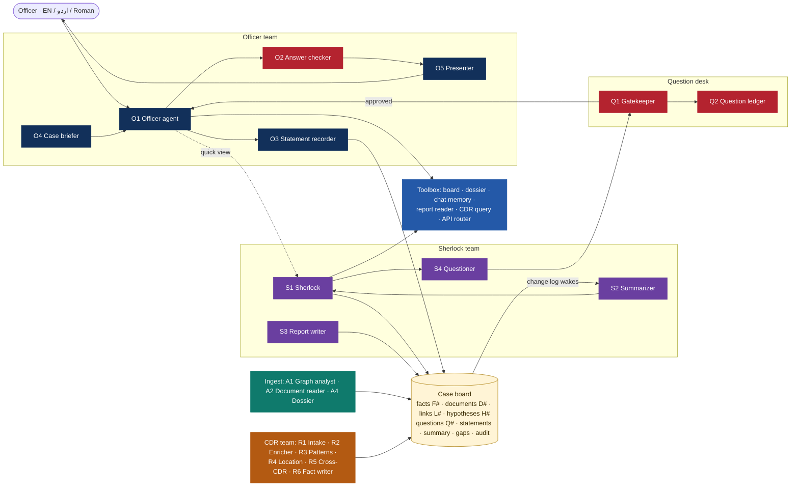

# Sherlock: how the agents work together

Two teams share one **case board**. The **Officer team** talks to the officer and makes
sure every question gets a correct answer. The **Sherlock team** works the case in the
background. The **Question desk** sits between them, so a question is never asked twice and
every answer the officer gives reaches Sherlock. The **Ingest team** and the **CDR team**
fill the board; the **shared toolbox** finds information for both teams and never guesses.

The design, with its reasons, is in `docs/sherlock-agent-plan.html`.

## The new case

The target is searched to learn who he is involved with; the case being worked is a
**new** one - the incident the officer describes (what, where, when, the FIR once there is
one). Previous FIRs, his and his associates', are background: `linkgraph/relevance.py`
says how each bears on the new case (same kind of crime, same area, people linked to the
target, recent), and the FIR answers, Sherlock and the summary all say it. "This case" in
a question means the new case once it is described.

## The case board

`evidence/case_file.py`. Every entry carries where it came from:

| Field | Meaning |
|---|---|
| `agent`, `event` | who wrote it, and the batch it belongs to (one upload, one CDR, one correction) |
| `tier` | `fact`, `inference` or `speculation` - how sure the claim is |
| `trust` | 1 system record · 2 document · 3 the officer · 4 derived by us · 5 unverified - who it comes from (`evidence/trust.py`) |
| `rests_on` | ids and topics it was built from (`F12`, `incident:date`, `owner:D9`) - what a correction follows |
| `replaces` / `replaced_by` | a correction: the old entry is kept, never deleted |
| `stale` | rests on something that changed: out of answers until the agent that made it redoes it |
| `rows`, `page` | where in the file or document it is |

Rules: **add, never rewrite**; every change goes into the change log (`case.changes`)
with its agent and event; listeners are told once per batch, never for a batch still open.

Besides facts, documents and links the board holds: the incident, roles, the question
ledger, the conversation, hypotheses `H#` with their history, the summary and timeline,
ranked gaps, dossiers, Sherlock's quick views given in chat, the Question desk's decisions,
follow-up messages, the audit log of live calls and the agenda of background work.

**Where it lives** (`evidence/board_store.py`): its own table `case_board` (migration
`9c4e1a7b2d30`), keyed by run, with the board's version. A save older than the stored board
is refused; a board posted back by the host that is older than the stored one does not
replace it - only the officer's own edits in it (roles, incident) are merged as new entries.
Every caller gets the **same** board object for a run (`RunManager.board`), also after the
run has left memory. A copy stays in the run's graph (`graph.case`) for exports.

## The Officer team: one reply

`linkgraph/sherlock_team.run_turn`.

1. **Corrections first** (`linkgraph/corrections.py`) - "nahi, 2 March tha" replaces what was
   said; without correction words a different value is confirmed once ("Pehle aap ne 1 March
   bataya tha. 2 March kar dun?").
2. **O3 Statement recorder** records what the officer states, with their words and a topic
   (`incident:date`, `role:<person>`); a value already on file is never silently overwritten.
3. **O0 Question reader** (`linkgraph/question_reader.py`) reads the message once: the act
   (a request like "explain me…" is a question), what is wanted, how deep (a yes / no, a
   count, a list - or the full story), the role asked about, the people, the scope (a
   person, the case, a connection), whether it is about the new case, and the one fact
   asked if only one is. **With the model its reading is the ask** - one structured call
   that reads the meaning of any wording; no keyword rule overrides it. Only structure is
   checked (names must be on the graph; a list is never "one fact"). The keyword rules are
   the fallback for when there is no model or the call fails.
   **O1 Officer agent** (`linkgraph/officer.py`) then asks his agents in turn and stops at
   the first that answers:
   1. **Dossier agent** (A4) - when the question is about a person: that person's card
      (identity, role, FIRs, links, documents, the officer's words, hypotheses);
   2. **the case board and the graph** - the Facts agent, the knowledge base, the
      connections;
   3. **API agent** - when 1 and 2 hold no answer (or the model's draft says it needs
      more), the police systems and FIR files are called **at run time** through the
      guard; what comes back goes on the board and O1 answers (redrafts) from it;
   4. none of them has it - the officer is told plainly "I did not find an answer", with
      every place checked, and asked where it may be recorded. Never a guess.

   Each step shows in the status line and the agent trail. A late follow-up is sent only
   if it adds something.
4. **O4 Case briefer** (`linkgraph/briefer.py`) builds the context pack at one board version:
   the chat (recent turns word for word, older ones summarised), the summary, Sherlock's view,
   what is new, the person in focus with their dossier, the matched facts (strongest tier
   first, duplicates merged, corrected entries left out), what the officer said and answered,
   sources in conflict, and **what is missing**. Each part has a size cap.
5. **The toolbox** - the Facts agent's exact answer by code, the API agent's calls through
   the API router (in parallel) - and **Sherlock's quick view** (`linkgraph/quick_view.py`)
   on every question with the model: one model call, no tools.
6. **O1 drafts**; **O2 Answer checker** checks; O1 fixes once; **O5 Presenter** lays it out.
7. **Every question gets Sherlock's input**: his quick view (with the model), or his
   assessment from the board - how the people asked about bear on the new case - or, when
   he has neither, the Questioner's most needed question.
8. The **Question desk** adds at most one approved question, last, in its colour: **red**
   (the case cannot move without it - what, where, when, the main suspect), **orange**
   (important), **green** (helpful). The Questioner sets it; Sherlock's own questions carry
   the priority he gives them.

In the portal every source is clickable - a document opens at the quoted line, the
officer's own words open highlighted in his statements, a police system ([PSRMS], [CRO])
opens that system's records with the fields the answer used highlighted - and the
Evidence section lists them all. **🕵 Case board** opens the detective's board: the new
case, the people, Sherlock's hypotheses, the records' facts, the officer's notes, the
open questions and the timeline, with red string from each person to every note about
them. The case panel shows what Sherlock is working on right now.

**Time budgets** (`linkgraph/budget.py`, settings `chat.*`): each step has a limit and a
fallback; the whole reply never takes over 40 s. What finishes late is sent as a
**follow-up** message in the same chat (`case.followups`; the portal polls for them).

| Step | Model | Budget | Over budget |
|---|---|---|---|
| O4 Case briefer | no | - | - |
| O1 draft | one call | 4 s | answer from the board and templates now, the model's answer follows |
| Toolbox / live calls | no | 3 s, in parallel | answer without them; their result follows |
| Sherlock's quick view | one call | 4 s | "Sherlock is looking into it"; his view follows |
| Investigator (open questions) | yes | what is left of the reply | his conclusion follows |
| O2 model check | only for claims no query computed | 3 s | rules only this time |
| O1 revise | yes | 3 s | the checked parts only |
| O5 Presenter | no (templates in all three languages) | - | - |

Every turn records each step's time, its model calls and what ran late (`final.timing`,
`final.model_calls`, `final.late`).

**While the officer waits** the chat shows one line saying what runs now - "Searching the
case board", "Checking NADRA · Kamran Ahmed", "Sherlock is thinking it through" - in the
officer's language, as shimmering text (`conversation.STATUS`, `TOOL_STATUS`; `status`
events on `POST /graph/investigate`). Fixed text, never written by the model.

### O2 Answer checker

`sherlock_team.validate`, code first:

| Rule | Check |
|---|---|
| Answered what was asked | a count question opens with the count; the reply does not open with a question |
| Correct | numbers match the Facts agent's result |
| Sourced | every id exists and is not replaced or stale; quoted text must be in the document it cites - a quote that is not is removed |
| Consistent | nothing contradicts the officer's statements (the model is asked only for claims no query computed) |
| Honest about gaps | nothing found, and the reply says so |
| Labelled | speculation is marked as Sherlock's view |

Sources that disagree are **shown, never hidden**: the reply leads with the more trusted one
and names both (`trust.conflicts`). Exception: for the incident's time and place and for
roles, the officer's word leads over the FIR.

### O5 Presenter

`linkgraph/presenter.py`: the first line answers, in bold; three or more FIRs become a
table (only when it keeps every number the bullets had); up to two short quotes from the
records with their source (translated when the officer's language differs and a model is
connected); Sherlock's view in its own labelled block; the question last. A **format guard**
compares every number, CNIC, phone, FIR number and source id with the checked answer; if
anything changed, the checked answer goes out as it is.

### The Facts agent and the knowledge base

Exact answers by code (`linkgraph/case_queries.py`, `offences.py`, `narrate.py`):

| Query type | Example | Answer |
|---|---|---|
| `cases` / `count_cases` | "ye kitni FIRs mein?" | FIRs with number, police station, role, crime in words, source; the count |
| `fir_status` | "kis FIR mein acquitted, kis mein convicted?" | each FIR's outcome from CRO / PSRMS and the FIR file |
| `serious_cases` | "koi khatarnak FIR?" | heinous / serious crimes first; FIRs where he is the complainant said apart |
| `fir_details` | "FIR 391/26 ki tafseel" | crimes, role, complainant, date, accused, the complainant's account, status |
| `io_report` | "IO ne guilty declare kiya?" | what the investigating officer concluded (challan, A/B/C class, 169), quoted |
| `criminals_near` / `criminals_all` | "his connections mein kitne criminals?" | people with a record, with how they are linked |
| `profile`, `connection`, `associates`, `hotels`, `phones`, `vehicles`, `documents`, `graph_stats`, `news`, `summary` | | from the graph and the board, each item with its source |

Every other question is answered from the live **knowledge base** (`linkgraph/knowledge.py`):
all people, record fields, links, FIR files and diaries, documents, the officer's
statements and Sherlock's hypotheses (corrected and stale entries left out), searched by
words, concepts in three languages and sound. A question about a person returns only
entries about that person; a topic no record holds is said to be missing, never guessed.

## The Question desk

`evidence/question_desk.py`. The Questioner (`evidence/questioner.py`) and Sherlock propose;
the **Gatekeeper** decides; the **ledger** (`case.questions`) keeps every question with its
topic key, how often and in which turns it was asked, its status (`open`, `answered`,
`dont_know`, `muted`) and the answer with its turn (earlier answers kept on a correction).

| Rule | |
|---|---|
| Same topic, same question | topic keys (`incident:when`, `roles:main`, `cdr_owner:D3`); free-form questions get one from their words |
| Answered anywhere closes it | the ledger, the board, or anywhere in the chat - said in passing, the answer is taken from that turn |
| "Don't know" counts | never asked again |
| Muted | "ye mat poocho" / "don't ask that" |
| Max two asks | never in two replies in a row; one per reply; none while the officer is busy asking something else |
| Checked twice | when proposed, and again just before it is asked |
| Tells Sherlock why | every rejection is logged with the reason and the answer on file; Sherlock reads them |

| Key | Asks |
|---|---|
| `incident:place` / `incident:pin` | where it happened (map) |
| `incident:what`, `incident:when`, `incident:fir`, `incident:vehicle` | which crime, when, the FIR, a vehicle or weapon |
| `roles:main`, `roles:victim` | the main suspect, the victim |
| `cdr_owner:D#`, `cdr_of:<person>` | whose a CDR is; upload the main suspect's CDR |
| `confirm_lookup:<number>` | a number that appears only in a document: may it be looked up? |
| `confirm_lookup:cdr:D#` | may the owners of a CDR's top contacts be looked up? |
| `link:why`, `suspects:other` | what ties the targets; anyone else suspected |

## Corrections

`linkgraph/corrections.py`: incident date, time and place; a person's role (also moved from
one person to another: "Kamran nahi, Imran"); the owner of a CDR. One event: the new
statement `replaces` the old, the ledger answer changes, everything that rests on the old
statement or the topic is marked stale, and the redo goes on the agenda (CDR incident window
and towers near the pin, re-filing a CDR's findings, dossiers, summary, Sherlock). The
officer is told what changed and what is being redone.

## The shared toolbox and the API router

The investigator's tools (`linkgraph/investigator.py`), the same for both teams, each team
with its own budget: **board** reader, **dossier**, **chat memory**, report reader
(`read_document`, `search_evidence`), **CDR query**, **API router**, plus the graph tools.

The **API router** (`linkgraph/api_router.py`) maps an ask to a topic and the catalog's
systems: identity (NADRA, CFMS), work (EVS, HOPE, HRMIS, SBVS, PRVS), vehicle (Excise, AVLC,
TRACS, DLS), phone (SIMs, Subscriber, Caller ID - unverified), address and family (PRVS, Old
Tenant, TRUST, DLS), record (PSRMS, CRO, Watchlist, ARMS), complaint (PFC, IGP CMS, MILAP),
hotel (Hotel Eye), footprint (OSINT - unverified). A CNIC-only system waits for the SIMs
lookup that finds the CNIC; systems already searched for the person are skipped, including
those that found nothing; a topic no system holds is said so.

## Ingest team and CDR team

* **A1 Graph analyst** (`evidence/graph_analyst.py`) - the scenario rules' patterns (repeat
  co-offenders, shared phones and vehicles, landlords, hotel overlaps, brokers...) onto the
  board as tiered facts, while the graph builds and when it is done.
* **A2 Document reader** (`evidence/collector.py`, `readers.py`, `uploads.py`) - FIR files,
  lab reports, CRO dossiers and uploads, as quoted facts.
* **A4 Dossier agent** (`evidence/dossiers.py`) - one card per person, rebuilt only when
  something about that person changed.
* **CDR team** (`evidence/cdr.py`, `evidence/cdr_team.py`): R1 Intake (columns, cleaning,
  each record's sheet row), R2 Enricher (owners of top contacts once the officer agrees, the
  handset behind an IMEI, the nearest police station), R3 Patterns (top contacts, silences,
  IMEI changes, habits), R4 Location (towers near the pin - "connected to a tower X km from the
  pin", never "was at" - movement on the incident day, likely home and work areas), R5
  Cross-CDR (calls between subjects, common contacts, the same tower within minutes), R6 Fact
  writer (each finding a fact with sheet and rows, fact or inference, filed under the number
  until the owner is known). Known formats also go to the CDR server; its report is compared
  with the team's own analysis.

## The Sherlock team in the background

`linkgraph/casework.py`. **S2** writes the summary and one timeline; **S1** keeps the
hypotheses (status, confidence, tier, evidence for and against - only ids on the board),
contradictions, concerns, labelled speculation, next steps, and checks his quick views;
**S4** ranks the gaps and sends Sherlock's own questions through the Gatekeeper.

What wakes it: a batch from outside the team finished (an upload, a CDR, a document, the
graph phase, a correction); the officer gave information; 15 facts outside any batch. It is
never woken by its own writes; a wake with nothing new from outside is skipped; several
events within two seconds start one run and runs never overlap. Background work waiting on
the board's agenda survives a restart. Runs per case: `evidence.sherlock_runs_per_case`.

## The case report

`evidence/case_report.py`, `report_pdf.py`. **S3 writes no new judgments**: the report lays
out the board - the summary, Sherlock's assessment and hypotheses with evidence for and
against, contradictions, suspicions in their own section, how the assessment changed, the
CDR analysis with rows, the officer's statements and every question, Sherlock's quick views
and whether they held, what was checked and found nothing, next steps, the timeline, the
evidence register, references and the audit of live calls.

On download, Sherlock first brings his assessment up to date (`evidence.report_wait_s`,
90 s); past it the report is built from his last assessment and the cover says "as of",
listing what is not yet assessed. The Answer checker runs on the report. A report is kept
per board version: a newer board means a new report.

## Safety and audit

`evidence/guard.py`, for every live call:

- **Document text is data** - every prompt that carries document text says so; the model only
  proposes calls, the guard decides.
- **Lookups only for people on the case** - a CNIC or number on the graph, written by the
  officer, or confirmed by the officer. One that appears only in a document waits for the
  officer (`confirm_lookup` question).
- **The officer's access applies** - a token may carry `sys`, the systems its officer may
  use (see `docs/INTEGRATION.md`).
- **Limits per case** - `evidence.case_live_calls` in all, `case_live_calls_per_hour`; admins
  are warned near the hourly limit.
- **Every call logged** - officer, case, agent, reason, system, identifier, made or refused:
  `case.calls`, the `sherlocks.audit` log, `GET /graph/runs/{id}/audit`.

## The chat test set

`linkgraph/eval_chats.py` (`python scripts/eval_chats.py`): fixed chats in English, Roman
Urdu and Urdu, with a correction, scored on answer-first, real sources, no repeated
questions, corrections kept, and reply time. `tests/test_eval_chats.py` holds the thresholds.

## Settings

| Setting | Default | Meaning |
|---|---|---|
| `chat.reply_budget_s` | 40 | the whole reply |
| `chat.draft_budget_s`, `tools_budget_s`, `view_budget_s`, `investigate_budget_s`, `check_budget_s`, `revise_budget_s` | 10, 10, 10, 25, 6, 6 | per step (capped by what is left of the reply budget) |
| `chat.pack_chars`, `chat.recent_turns` | 14000, 4 | the context pack |
| `evidence.chat_live_calls` | 6 | live calls per chat question |
| `evidence.background_live_calls` | 4 | live calls per Sherlock team run |
| `evidence.case_live_calls`, `case_live_calls_per_hour` | 120, 40 | per case |
| `evidence.sherlock_runs_per_case` | 20 | background runs per case |
| `evidence.report_wait_s` | 90 | Sherlock's catch-up before a report |
| `evidence.cdr_radius_km` | 2 | "near the incident" |
| `EMS_CDR_API_URL`, `EMS_CDR_API_KEY` | - | the CDR server |

## API

| | |
|---|---|
| `POST /graph/investigate` | one chat turn (SSE): `start`, `status` (the waiting line), `agent`, `step`, `final {answer, checks, questions, citations, timing, late, followup_pending}` |
| `GET /graph/runs/{id}/case` | the board now, with `hypotheses`, `summary`, `gaps`, `followups`, `agenda` |
| `GET /graph/runs/{id}/audit` | every live call for the case, with totals |
| `GET /graph/runs/{id}/report.pdf` | the case report (Sherlock's assessment, brought up to date) |
| `POST /graph/runs/{id}/uploads` | multipart `file` (+ `note`, `owner`) |
| `POST /graph/runs/{id}/incident` | `{lat, lon, place, date, time, fir}` |
| `POST /graph/runs/{id}/questions/{Q#}` | `{answer, pid?}` |
