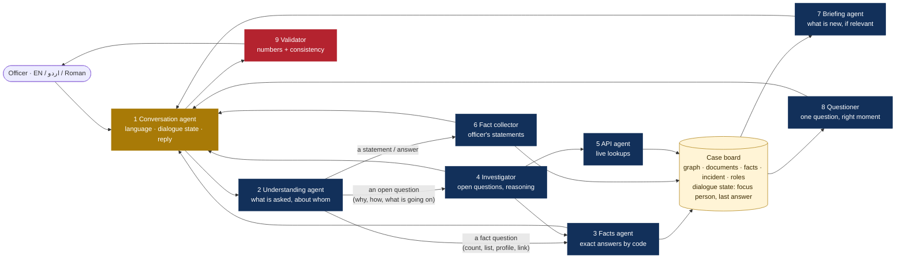

# Sherlock conversation: plan

## What went wrong (from a real session)

| Officer | Sherlock did | Should have done |
|---|---|---|
| "ye kitni firs ma involve ha?" | listed 37 patterns of the whole graph | understood **ye = Muhammad Danish Rafiq** (the person just discussed) and answered "**5 FIRs**", listing them |
| "total no of criminals found in his connections?" | the same pattern list | counted the people with a criminal record among **his** connections: "**3**", named them |
| "total criminal in whole graphs?" | the same pattern list | "**12** people on the graph have a criminal record", named them |
| any message | appended every new FIR read since the last message | one short line ("I have also read 5 new FIR files"), details only when asked or when they concern the person being discussed |
| any message | asked "Where did the incident happen?" again and again | ask at a natural moment, never the same question within three turns |

Root causes:

1. **No dialogue state.** Each message was handled alone: no "who are we talking about", so pronouns (ye, wo, his, یہ) meant nothing.
2. **No understanding step.** Every question went to the open-ended investigator; without the AI model its fallback is "list the patterns".
3. **Counts and lists were left to the model**, which is the wrong tool: numbers must be computed, not written.
4. **Briefing and questions were pushed every turn** instead of when useful.
5. The server ran **without the AI model** (`rule-based` under each reply), so the rule paths are what the officer actually gets; they must answer correctly on their own.

## The agents and their single jobs



| # | Agent | One job | Without the model |
|---|---|---|---|
| 1 | **Conversation agent** | Detects the language; keeps the **dialogue state** (the person being discussed, the last answer); resolves "ye / wo / his / یہ / he" to that person; writes the reply naturally in the officer's language; asks back when a name is ambiguous ("Danish Shahid or Danish Khan?") | templates per answer type, in English, Roman Urdu and Urdu |
| 2 | **Understanding agent** | Turns the message into a **structured query**: type (cases, count of cases, criminals near a person, criminals in the graph, profile, connection between two, hotel stays, phones/SIMs, vehicles, documents, summary, what's new, open question) + people | keyword rules in all three languages ("kitni", "how many", "تعداد", "mujrim", "criminal", "ملزم"...) |
| 3 | **Facts agent** | Answers fact questions **by code** from the graph and case board: exact counts and lists, each item with its source | the same: no model needed |
| 4 | **Investigator** | Open questions only ("how is A tied to B", "what is going on here"): plans tool calls, reasons over the evidence | the rule plan for the people named |
| 5 | **API agent** | Live lookups when the answer needs data not yet gathered | same |
| 6 | **Fact collector** | Records what the officer **states** (roles, incident, events) with their words | rules |
| 7 | **Briefing agent** | Tells what is new **only** when asked ("kya naya hai?") or when it concerns the person being discussed; otherwise one short line, once | same |
| 8 | **Questioner** | One question at a natural moment: after a statement or greeting, or when the answer needs it (e.g. "near the scene" needs the incident pin); never the same question within three turns | same |
| 9 | **Validator** | Every **number** in the reply must match the Facts agent's result; no contradiction with the officer's statements; only real sources | number check by code |

## One turn

```mermaid
sequenceDiagram
  autonumber
  participant O as Officer
  participant CV as Conversation agent
  participant U as Understanding agent
  participant FA as Facts agent
  participant V as Validator
  O->>CV: "ye kitni firs ma involve ha?"
  CV->>CV: language = Roman Urdu; focus = Muhammad Danish Rafiq (from the last turn)
  CV->>U: message + focus
  U-->>CV: {type: count_cases, people: [Danish]}
  CV->>FA: count_cases(Danish)
  FA-->>CV: 5 FIRs (45/2023 Accused [PSRMS], …)
  CV->>CV: "Muhammad Danish Rafiq 5 FIRs mein shaamil hai: …"
  CV->>V: reply + the facts
  V-->>CV: number 5 matches
  CV-->>O: reply (+ one question only if useful)
```

## What the Facts agent answers exactly

| Query type | Example (any language) | Answer |
|---|---|---|
| `cases` / `count_cases` | "Danish kin cases mein hai?", "ye kitni FIRs mein?" | FIRs with number, police station, role, offence, source; the count |
| `fir_status` | "har FIR ka status?", "kis FIR mein acquitted, kis mein convicted?" | each FIR's outcome (convicted, acquitted, under trial, on bail, under investigation, closed) from the CRO / PSRMS status and the FIR file's case positions and result, with an overall count |
| `serious_cases` | "koi khatarnak FIR?", "qatl ka case hai?", "gaari chori mein?" | the FIRs for heinous / serious crimes (or the crime asked), most serious first; FIRs where he is the complainant, victim or witness are said apart ("bhi sangeen hai, lekin us mein woh muddai hai"); the lighter ones summarised |
| `fir_details` | "har FIR mein kya ilzaam hai?", "FIR 391/26 ki tafseel" | per FIR: the crimes in words, his role, the complainant, date, accused, the complainant's account from the FIR file, the status |
| `io_report` | "IO ki report kya hai?", "investigation officer ne guilty declare kiya?" | per FIR, what the investigating officer concluded, read from the FIR file's report, diaries and case position: challan (sent to court), interim challan 512 CrPC (accused absconding), A / B / C class (closed: untraced / false / civil), released under 169, still under investigation - with the IO's name and the report's own sentence quoted, and the reminder that guilt is for the court |
| `criminals_near` | "his connections mein kitne criminals?" | people linked to him (stated links; inferred listed apart) who have a criminal record, with how they are linked |
| `criminals_all` | "total criminals in the whole graph?" | everyone on the graph with a criminal record, the count, their FIRs |
| `profile` | "Danish kaun hai?", "tell me about Danish" | identifiers, role, cases, flags, links, documents |
| `connection` | "Danish aur Sajid ka kya taluq?" | stated route(s) first, then inferred, each hop with its source |
| `associates` | "us ke saathi kaun hain?" | his direct links, stated first |
| `hotels`, `phones`, `vehicles` | "kahan thehra tha?", "us ke numbers?" | stays / SIMs / vehicles with sources |
| `documents` | "us ke bare mein documents?" | case documents that name him, with their facts |
| `graph_stats` | "graph mein kitne log hain?" | people, criminals, FIRs, documents |
| `news` | "kya naya mila?" | the briefing |
| `summary` | "case ka khulasa" | targets, key links, findings, open gaps |

## Answers in words, without the AI model

Every computed answer opens with what an investigator would say first, in the officer's language
(`linkgraph/narrate.py`), then the cited list:

- **Crimes by name, not section numbers** (`linkgraph/offences.py`): PPC, CNSA, Arms Act and ATA
  sections become murder, attempted murder (324), rape (375/376; with 511: attempted), sexual assault (377),
  kidnapping (359-369), dacoity (395-402), extortion / bhatta (384-389), robbery (392-394), vehicle theft
  (381-A), theft, narcotics, arms, hurt (337), cheque bounce (489-F), fraud, breach of trust (406)... each
  with a seriousness (heinous / serious / other) and named in English, Roman Urdu and Urdu.
- **His role in each FIR** from the FIR file (complainant / accused / witness by CNIC), else the systems'
  role words (PSRMS "AFFP" = the affected party). An FIR where he is the victim is never counted against him.
- **Duplicates merged**: "1124/25" and "1124/2025" are one FIR.

Example (real run, no model): "koi khatarnak FIR?" ->
"Haan - Muhammad Danish Rafiq 2 sangeen FIR(s) mein mulzim hai: FIR 391/26 (zina bil jabr ki koshish, zakhmi
karna) aur FIR 488/25 (iqdam-e-qatl). FIR 345/26 (iqdam-e-qatl, aghwa...) bhi sangeen hai, lekin us mein woh
muddai hai, mulzim nahi. Baqi 3 FIRs halke jurm ke hain: cheque bounce (2) aur amanat mein khayanat (1)."

With the AI model, the model gets the same worded answer and writes the reply from it.

## Beyond the fixed types: the knowledge base

The types above are answered exactly by code. **Every other question** - a job, relatives,
a witness's statement, what the case diary says, who filed FIR 345/26 - is answered from
the live knowledge base (`linkgraph/knowledge.py`): all people, record fields, links, FIR
files and case diaries, lab / CRO / uploaded documents, the officer's statements and the
incident, searched by words, concepts (three languages) and sound. A question about a person
returns only entries about that person; a topic no record holds is said to be missing, not
guessed. With the AI model, the model writes the answer from these entries; without it, the
entries are listed with their sources. See `SHERLOCK_AGENTS.md`, "The knowledge base".

| Officer | Answer (a real run, names changed, no model) |
|---|---|
| "danish kahan rehta hai?" | his DLS and telecom subscriber addresses, with sources |
| "FIR 345/26 ka muddai kaun hai?" | the complainant quoted from the FIR file |
| "danish kis gawah ke sath hai FIR 884/26 mein?" | the witnesses of FIR 884/26 |
| "danish ke walid ka naam?" | father: Rafiq Anwar (not a witness whose name contains "ولد") |
| "danish ka kaam kya hai?" | "Records mein Muhammad Danish Rafiq ke is bare mein kuch nahi mila" |

## When nothing is known: the Research agent

If the knowledge base and the Facts agent come back empty for a person or an FIR - or the FIR asked
about has not had its file read - the Research agent (`linkgraph/researcher.py`) makes the calls that
would answer it, within the per-question budget, then the answer is rebuilt:

| Asked | Calls |
|---|---|
| an FIR's details / status, file not read | PSRMS FIR file (+ Labs reports if lab / DNA / medical is asked) |
| CRO, dossier, photos | SAFE CRO dossier |
| job / employer | EVS, HOPE, HRMIS, PRVS |
| vehicles | Excise, AVLC, TRACS, DLS |
| phones | SIMs, subscriber, caller ID |
| hotel stays | Hotel Eye |
| weapons | Arms |
| FIRs, record | PSRMS, CRO, watchlist |

Systems already searched for that person are skipped. The reply ends with what was checked live
("Yeh pehle parhe gaye records mein nahi tha, is liye maine abhi check kiya: EVS lookup, ...").

## Build steps

1. Dialogue state on the case board (focus person, last query) + pronoun resolution.
2. Understanding agent: rules (three languages) + model (structured), falling back to rules.
3. Facts agent: the query types above, by code, with sources.
4. Conversation agent: model reply from the facts; templates per type per language without it.
5. Briefing and Questioner: only when relevant; no repetition.
6. Validator: numbers and consistency.
7. Tests with the exact messages from the failing session (Roman Urdu, English, Urdu).

## The Questioner, in detail

It asks throughout the chat, one question per reply, from the case's gaps (most useful first):

| Key | Asks | The answer goes to |
|---|---|---|
| `incident:place` | where it happened (📍 map button) | incident place; then `incident:pin` once, to get coordinates |
| `incident:what` | which crime | incident offence |
| `incident:when` | date and time | incident date / time |
| `roles:main` | the main suspect (person buttons) | role "main suspect" |
| `incident:fir` | FIR number, year, police station | incident FIR |
| `cdr_owner:D#` | whose an uploaded CDR is | the CDR's owner; phone-contact links on the graph |
| `roles:victim` | the victim / complainant | role "victim" |
| `incident:vehicle` | vehicle or weapon used | incident vehicle / weapon |
| `link:why` | what ties the targets | the officer's statements |
| `suspects:other` | anyone else suspected (CNIC / number) | numbers to search next |
| `cdr_of:<person>` | upload the main suspect's CDR (once the incident is pinned) | - |

Memory rules:

- **An answered question never comes back.** "pata nahi / don't know / نہیں معلوم" is an answer too.
- **A gap filled another way closes its question** - stated in chat ("waqia 7 Aug ko hua"), pinned on the map.
- **An answer is matched to the latest open question it fits**, even with other questions in between: a date
  answers "when", a person answers "who", an FIR number answers "which FIR"; a bare name never answers "when".
- **Each question is asked at most twice**, never twice in a row; while the last one is unanswered and the officer
  asks something else, no new question is added.
